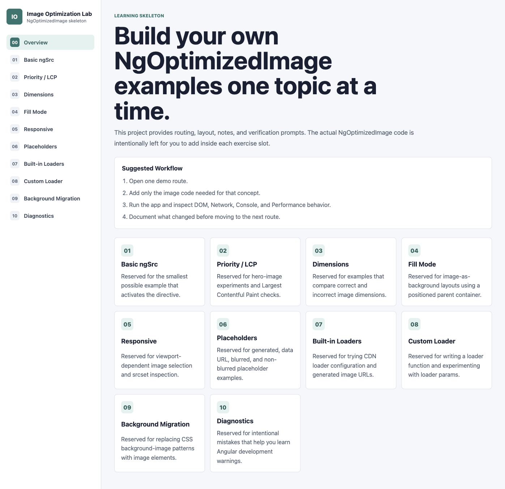

# NgOptimizedImage Learning Lab



This is a test Angular project for learning and practicing `NgOptimizedImage`.

The project is intentionally built as a skeleton: it provides routes, layout, exercise slots, notes, and verification checklists, but leaves the actual `NgOptimizedImage` implementation work for the learner to add manually.

## What This Project Teaches

- Basic directive activation with `ngSrc`.
- Marking important images as `priority`.
- Understanding LCP image behavior.
- Using `width` and `height` to prevent layout shifts.
- Comparing correct and incorrect image dimensions.
- Using fill-mode layouts with positioned parent containers.
- Practicing `object-fit` and `object-position`.
- Working with responsive images and the `sizes` attribute.
- Inspecting generated `srcset` behavior.
- Trying image placeholders.
- Comparing blurred, non-blurred, and data URL placeholders.
- Configuring built-in image loaders.
- Preparing a custom image loader.
- Experimenting with loader params.
- Migrating CSS `background-image` patterns to image elements.
- Creating controlled broken examples to learn Angular diagnostics and warnings.
- Verifying image behavior with browser DevTools, Network, Console, and Performance panels.

## Project Structure

Main learning pages live under:

```text
src/app/pages/
```

The current exercise routes are:

- `/basic-ng-src`
- `/priority-lcp`
- `/dimensions`
- `/fill-mode`
- `/responsive-images`
- `/placeholders`
- `/loader-demo`
- `/custom-loader`
- `/background-migration`
- `/diagnostics`

Shared layout components live under:

```text
src/app/shared/
```

Image loader placeholders live under:

```text
src/app/image-loaders/
```

## Development Server

Run:

```bash
npm start
```

Then open:

```text
http://localhost:4200/
```

## Build

Run:

```bash
npm run build
```

## Unit Tests

Run:

```bash
npm test -- --watch=false
```
